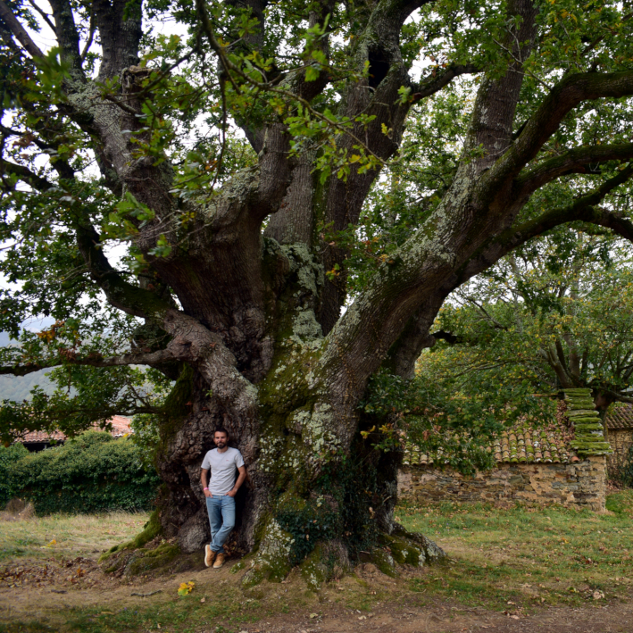

---

:::: {style="display: flex;"}

::: {}
{width="68%" height="68%" .img-circle}
:::

::: {}
> I am an Associate Professor of Botany at the University of Oviedo and a researcher at the Biodiversity Research Institute ([IMIB](https://imib.csic.es/)). My work focuses on seed regeneration as a key process for biodiversity and habitat restoration, combining vegetation ecology with open-science approaches and biocultural perspectives.
:::

::::

---

## Research

* SeedAnthropic: Seed regeneration in anthropogenic and invaded habitats.
* [SeedArc](https://www.unioviedo.es/seedarc/index.html): A global archive of primary seed germination data.
* My publications in [ORCID](https://orcid.org/0000-0002-4743-9577), [Google Scholar](https://scholar.google.com/citations?user=1DSeLw0AAAAJ&hl=en), and [ResearchGate](https://www.researchgate.net/profile/Eduardo-Fernandez-Pascual-2).
* My datasets & code are available in [GitHub](https://github.com/efernandezpascual). Also check the [SylvanSeeds](https://efernandezpascual.github.io/home/sylvanseeds.html) database and the [seedr](https://efernandezpascual.github.io/home/seedr.html) R package.

---

## Outreach

* Join me in [iNaturalist](https://www.inaturalist.org/people/efernandezpascual) to observe our plant diversity.
* Check our project to catalogue the plants of the [University of Oviedo](https://www.inaturalist.org/projects/uniovi-flora-de-la-universidad-de-oviedo).
* Follow my little explorations of the plant and biocultural diversity of Asturias in [Instagram](https://www.instagram.com/efernandezpascual/).

---

## Contact

* My profile at the [Department of Organismal and Systems Biology](https://portalinvestigacion.uniovi.es/investigadores/218880/detalle).
* My profile at the [Biodiversity Research Institute (IMIB)](https://imib.csic.es/eduardo-fernandez-pascual/).
* Connect with me on [LinkedIn](https://www.linkedin.com/in/eduardo-fern%C3%A1ndez-pascual-ba9683398/).
* [Email](mailto:fernandezpeduardo@uniovi.es) me.

---

