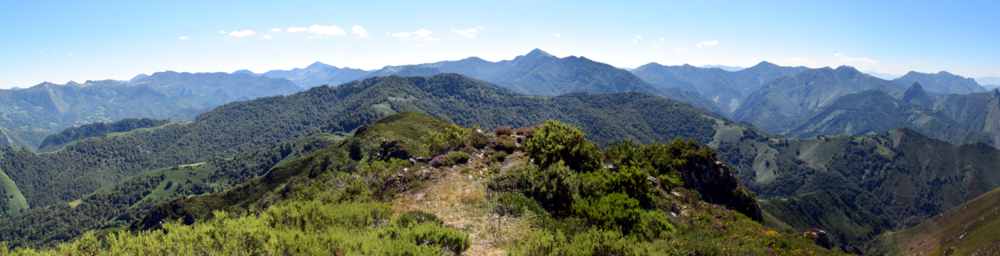

{width="100%" height=auto}

I'm a biologist working on plant ecology and conservation, with a focus on plant regeneration by seed:

* The environmental control of seed germination timing in wild species, and how this control is affected by climatic changes.

* The patterns and drivers of seed diversity across species and communities.

* The application of seed science in plant conservation and ecological restoration.

My main study system are the diverse plant communities of the Cantabrian Mountains of Spain, including temperate forests, mires and alpine meadows.

Currently I serve as curator of collections at the [Jardín Botánico Atlántico](https://www.gijon.es/es/directorio/jardin-botanico-atlantico-de-gijon) and I am a member of the [Vegetation & Biodiversity Lab](https://jimenezalfaro.weebly.com/) at the IMIB Biodiversity Research Institute, University of Oviedo.

In this website you can find the datasets and codes of my publications, plus some research tools, like the SylvanSeeds database and the seedr R package. Please get in touch for comments or questions about any of these items.

---

