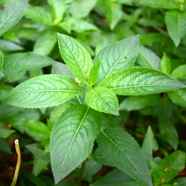

---

<!-- 
 -->

<!-- {width=auto height="30%" .img-circle} -->

<!-- 
 -->

<!-- 
 <h1>[sPlot12](https://www.idiv.de/en/sdiv/working_groups/wg_pool/splot/projects.html)</h1> 
 -->

<!-- 
`sPlot` is a global repository for plant community data, containing more than 1 million records with full lists of plant species co-occurring in small areas (plots). It provides a big data infrastructure for collaborative biodiversity research. In `sPlot` project #12 we are studying seed ecology in the temperate deciduous forests of the northern hemisphere. We have compiled a global germination dataset to study biome-wide patterns in the regeneration niche.
 -->

<!-- --- -->

{width=auto height="30%" .img-circle}

 <h1>[NGSeeds](https://www.researchgate.net/project/NGSeeds-lab)</h1> 

Big data has given plant scientists unprecedented potential to quantify large-scale patterns in plant ecology and evolution. While vegetative traits have been studied in detail, reproductive features such as pollination, dispersal and germination have received less attention. The aim of the `NGSeeds` (Next Generation Seed Ecology, Evolution and Data Science) virtual research group is to share and synthesize knowledge on functional seeds traits, with the final goal of understanding the role of ecological conditions, evolutionary constraints and biogeographical features in shaping the regenerative niche of plants.

---

{width=auto height="30%" .img-circle}

 <h1>[ALPVEG](https://www.alpveg.com/)</h1> 

`ALPVEG` is a virtual research network for linking projects and researchers dealing with the distribution, diversity and regeneration dynamics of alpine vegetation. Alpine vegetation is the diversity of plant communities that occur above the climatic treeline in world mountains. These ecosystems support high biodiversity value and multiple services. Although alpine plants have attracted naturalists for centuries, we still ignore fundamental patterns and drivers of alpine vegetation within and across regions. In `ALPVEG` we use observational and experimental data to assess the influence of environmental drivers on alpine plant communities and their dominant or indicator species.

---

<!-- 
 -->

<!-- {width=auto height="30%" .img-circle} -->

<!-- 
 -->

<!-- 
 <h1>[SOS Praderas](https://www.sospraderas.eu/en/)</h1> 
 -->

<!-- 
`SOS Praderas` (2016-2019) promoted the sustainable management of hay meadows to ensure their conservation. Hay meadows are species-rich semi-natural habitats of great cultural and biological value in Europe. The abandonment of traditional agricultural practices is threatening their survival. `SOS Praderas` contributed to stop the loss of meadow biodiversity through innovative measures such as drafting new agri-environmental subsidies and the marketing of novel products (seed mixes).
 -->

<!-- --- -->

<!-- 
 -->

<!-- {width=auto height="30%" .img-circle} -->

<!-- 
 -->

<!-- 
 <h1>[Gedan Lab](http://www.gedanlab.com/)</h1> 
 -->

<!-- 
In 2017 I had the opportunity to join the `Gedan lab` at the `George Washington University`, and I got to enjoy a field season in the salt marshes of rural Maryland. We studied the novel plant communities colonizing old agricultural fields that had to be abandoned as a consequence of rising sea level and saltwater intrusion. Read more in <a href="https://www.theatlantic.com/science/archive/2018/03/maryland-salt-farms/554663/">The Atlantic</a> and <a href="https://www.the-scientist.com/features/climate-change-is-killing-east-coast-forests-67149">The Scientist</a>.
 -->

<!-- --- -->

<!-- 
 -->

<!-- {width=auto height="30%" .img-circle} -->

<!-- 
 -->

<!-- 
 <h1>[NASSTEC](https://nasstec.eu/home)</h1> 
 -->

<!-- 
`NASSTEC` (2014-2017) was a Marie Curie Initial Training Network that trained 11 PhDs in native seed science, conservation and technology. Its goal was to increase European capacities in seed-based environmental restoration.`NASSTEC` connected the public and private sector to establish a multidisciplinary European Doctoral School integrating knowledge in seed biology, plant ecology, molecular biology, conservation, environmental science, crop science and horticulture.
 -->

<!-- --- -->

<!-- 
 -->

<!-- {width=auto height="30%" .img-circle} -->

<!-- 
 -->

<!-- 
 <h1>[Pritchard Lab](https://www.kew.org/science/our-science/departments/comparative-plant-and-fungal-biology/comparative-seed-biology)</h1> 
 -->

<!-- 
Between 2015 and 2016 I got a personal grant to join the `Pritchard lab` (Comparative Seed Biology) at the `Royal Botanic Gardens, Kew`. There we studied plant regeneration under climate change, focusing on two aspects: (1) the application of thermal time germination models to simulate germination under climatic scenarios and (2) seed memory, the capacity of seeds to integrate past and present environmental cues to adjust their germination timing.
 -->

<!-- --- -->

<!-- 
 -->

<!-- {width=auto height="30%" .img-circle} -->

<!-- 
 -->

<!-- 
 <h1>[Life Tremedal](https://lifetremedal.eu/en/)</h1> 
 -->

<!-- 
`Life Tremedal` (2012-2015) improved the state of conservation of Natura 2000 wetlands in the north of the Iberian Peninsula. Continental wetlands, including peat bogs and fens, depend on unique water regimes to survive and provide valuable ecosystem services. `Life Tremedal` implemented conservation actions including the management of livestock grazing and the *ex situ* conservation of seeds.
 -->

<!-- --- -->